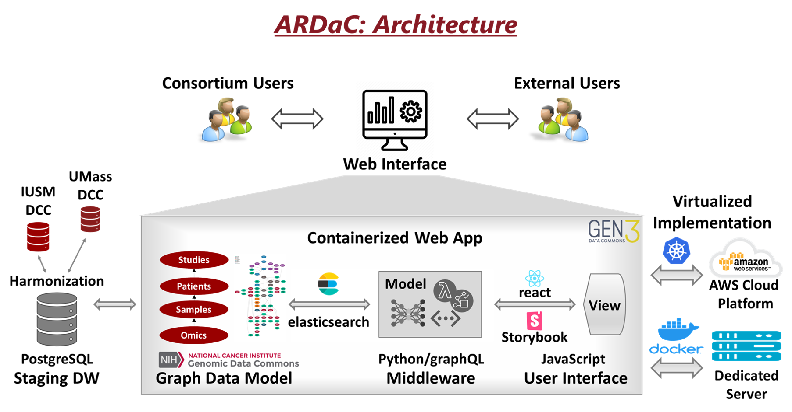

# ARDaC
The AlcHepNet project, sponsored by the National Institute on Alcohol Abuse and Alcoholism (NIAAA), aims to improve the treatment of alcoholic hepatitis, a leading cause of liver-related morbidity and mortality. The AlcHepNet consortium is composed of 8 clinical study sites and 10 research projects including clinical studies, translational studies, and basic or preclinical studies. The network is recruiting over 1,700 participants for clinical studies, following up participants for 180 days, collecting more than 24,000 blood, urine, saliva, and liver biopsy biosamples, capturing demographic and behavioral features, clinical conditions, laboratory tests, treatments, and outcomes, and generating multiomics data from microbiome, immunologic, proteomic, metabolomic, lipidomic, and RNA/ChIP-sequencing analyses. The Indiana University Data Coordinating Center (IU DCC) and the University of Massachusetts Data Coordinating Center (UMass DCC) are collaboratively providing the essential research infrastructure, including experimental design, study implementation, data management, and statistical analysis in support of the two primary studies within the network, a clinical trial and an observational study, as well as the translational projects that utilize the biospecimens collected by the two primary studies. To facilitate the effective research use of the rich and complex AlcHepNet data, the IU DCC is developing ARDaC, the Alcoholic Hepatitis Network Research Data Commons as the central data hub and research nexus. 

# Design of ARDaC 
The architecture of the ARDaC system is composed with following components: 
1)	The ARDaC Data Warehouse . The heterogeneous clinical data, biosample information, and omics data information will be extracted from the IU DCC and UMass DCC, standardized according to the ARDaC Data Standard, harmonized according to the ARDaC Common Data Model, and hosted in a central ARDaC Data Warehouse. Specifically, the novel ARDaC Common Data Model is derived from and compatible with the Genomics Data Common (GDC)[1] Data Model and is compliant with the FAIR Principles[2] so that AlcHepNet multimodal data will be findable, accessible, interoperable, and reusable. The ARDaC Data Warehouse is the data source for the ARDaC web application open to the public as well as for regular reporting and customized services within the AlcHepNet consortium. A graph-based provenance model is used for comprehensive data dependency and version control so that the ARDaC digital entities, including the standards, data model, data, metadata, scripts, and codes, are attributable, trackable, and reproducible.  
2)	The ARDaC web application. The ARDaC system uses the Gen3 data common framework, which has been widely used in NIH-sponsored projects. At the data layer, the standardized and harmonized data is extracted from the ARDaC Data Warehouse and injected into the ARDaC Staging Data Warehouse according to the ARDaC Graph Data Model. In the middleware layer, based on the user’s input of the filtering criteria, the graph-based data is queried using graphQL through the elastic search engine, analyzed with Python, and delivered interactively to users using the JavaScript-based react and Storybook libraries. The ARDaC web application is containerized as a series of images, each providing a specific service. The ARDaC system can be and deployed to the AWS cloud services through the Kubernetes platform or to a dedicated server through the Docker platform. 
By leveraging the GDC common data model and the Gen3 data commons ecosystem, ARDaC enables the data integration with other NIH-funded data commons and delivers broad impact of AlcHepNet research and data to other research communities. 

# Essential functionalities. 
The novel ARDaC system supports the representation of behavioral and pathologic data unique to alcoholic hepatitis, facilitates data filtering, querying, visualization, and exploring which are specific to the AlcHepNet clinical studies . Besides the general data query and visualization functions, ARDaC allows data exploration using the study-related criteria such as the study cohorts or arms, alcohol use history, alcoholic hepatitis treatments, prognosis information such as mortality and liver transplantations, liver functions such as MELD’s scores, omics data availability and biosample availability, and omics-derived features such as differentially expressed genes and enriched signaling pathways. ARDaC system also provides GraphQL query interface, cloud-based workspace, and R and Python programming environments for in-depth data analysis. Specifically, if researchers are interested in proposing new data generation plan, ARDaC allows users to check sample availability, to visualize and evaluate the synergy of their data generation plans with existing data and funded projects, and to plan for new data generation plans. 
The ARDaC system is available at [github.com/jing-su/ardac](github.com/jing-su/ardac) and [ardac.org](ardac.org). 

# Summary 
In summary, ARDaC is the central data hub connecting data of multiple modalities across clinical and translational teams, the engine to drive AlcHepNet research projects, the data interface between AlcHepNet consortium and research other data commons, and the research nexus to ignite new research and collaborations. 

# Team at Biostatistics and Health Data Science, Indiana University School of Medicine 
## PI: 
  * Dr. Wanzhu Tu, Professor  
  * Dr. Jing Su, Assistant Professor  
## Data modeling and harmonization 
  * Carla Kettler, Principal Data Manager
  * Dr. Chi Mai Nguyen, Research Scientist 
  * Ronny Ovando, Senior Data Manager 
  * Timothy Hotchkiss, Data Manager II 
  * Ryan Healey, Data Manager I
## System development and visualization
  * Greg Peutz, Research Information Principal
  * Nanxin Jin, PhD Research Assistant 
  * Zuotian Li, PhD Research Assistant 

